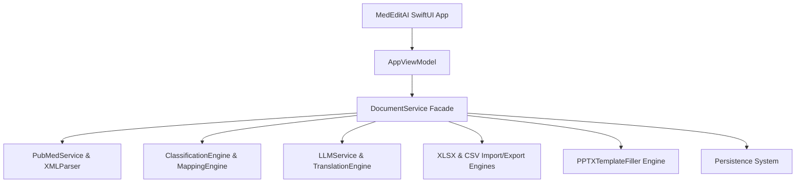

# MedEditAI

> **An Elegant Medical Literature Processing and Presentation App for macOS**

MedEditAI is a production-grade macOS tool designed specifically for medical editors. It automates tedious work tasks such as searching and downloading PubMed entries, parsing metadata, classifying studies and topics, evaluating journal Impact Factors (IF), and instantly formatting outputs into structured Excels and vertical A4 single-page presentation slides (one-page PPTX).

---

## 🚀 Key Features

* **PubMed Desktop Retrieval & Parser:** Streamlined, multi-record PubMed parsing via public APIs (`esearch` / `efetch`). Fast, reliable, and limits network requests with robust rate-limiting controls.
* **Intelligent File Scaffolding & Custom Translators:** Support for flexible custom layouts. No rigid Excel structures required—columns are mapped dynamically.
* **Study Design & Topic Taxonomy Split:** Decoupled classification engines (How vs. What) supporting deep hierarchical structures (up to 4 levels) and custom term dictionaries.
* **On-Demand Impact Factor (IF) Integration:** Import custom IF databases to enrich literature metadata without relying on restricted or premium third-party web APIs.
* **Automated A4 One-Page Slide Generation:** Packages standard slides leveraging client PPTX templates through advanced template filling engines.
* **Pluggable AI Co-Pilots:** Supports various cloud LLM backends (OpenAI-compatible) and local/offline processing rules to automate translation, classification, and medical entity/product tagging.

---

## 🛠️ Architecture & Tech Stack



* **Frontend:** SwiftUI (macOS 14+), Native 3-Pane Navigation Workspace (`NavigationSplitView`).
* **Packaging Tooling:** Custom OOXML `XLSX` reader/writer engines & `PPTX` template filler using standard Unix zip/unzip subprocess bindings (strictly dependency-free; zero External C libs required).
* **AI Provider:** Configurable cloud-compatible endpoints alongside an offline failover provider.
* **Unit Testing:** Full-coverage suite powered by `XCTest` targeting files, databases, parsers, and processing loops.
* **Continuous Integration:** Automated linting, building, and test runners inside GitHub Actions hosted on `macos-15` virtualization hosts.

---

## 📁 Repository Map

* [Sources/](Sources/) - Swift source code.
  * [Sources/MedEditAIApp/](Sources/MedEditAIApp/) - SwiftUI App Views, Components, and the VM.
  * [Sources/MedEditAIApp/Core/](Sources/MedEditAIApp/Core/) - Processing engines (XLSX, PPTX, Parser, LLM, Mapping).
* [Tests/](Tests/) - Unit test suite.
* [Samples/](Samples/) - Raw real-world case artifacts and client slide/spreadsheet templates.
* [prototype/](prototype/) - Dynamic High-Fidelity Web prototype for visual reference.
* [产品设计文档.md](产品设计文档.md) - Deep-dive Product Requirements Document (PRD) detailing business workflows and design models.

---

## ⚙️ Building & Running Locally

### Prerequisites
* A Mac running **macOS 14 (Sonoma)** or **macOS 15 (Sequoia)**.
* **Xcode 15.3+** (with Swift 5.10 toolchain).

### Option 1: Xcode IDE (Recommended)
1. Double-click the macOS Xcode Project files: `MedEditAI.xcodeproj`.
2. Select your run target (e.g., Mac App).
3. Press `Cmd + R` to compile and run or `Cmd + U` to execute all unit tests.

### Option 2: Command Line Interface
You can interact with the app structure directly from the Terminal:

* **Resolve SPM Dependencies:**
  ```bash
  swift package resolve
  ```
* **Build Project:**
  ```bash
  swift build -c release
  ```
* **Run Unit Tests:**
  ```bash
  swift test -v
  ```

---

## 🤖 CI Workflow

This repository runs a continuous integration flow via **GitHub Actions** on a `macos-15` runner. Every push and PR triggers:
* Swvers & Toolchain identification.
* Dependency resolutions.
* Unit-test suite run.

See [.github/workflows/macos-ci.yml](.github/workflows/macos-ci.yml) for full details.
