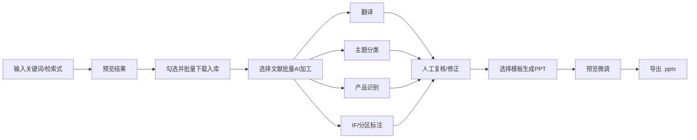
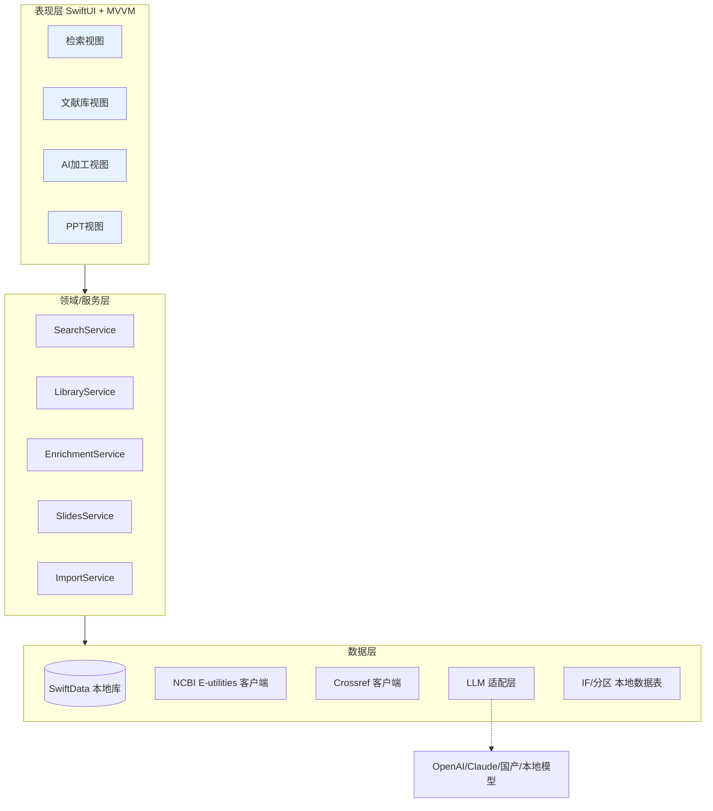

# MedEditAI — 面向医学编辑的智能文献处理工作台
## 产品设计文档 (PRD) 与技术实现方案

> 版本：v1.0　｜　平台：macOS（后续可扩展 iPadOS）　｜　文档性质：产品设计 + 技术方案

---

## 目录

1. [产品概述](#1-产品概述)
2. [目标用户与用户画像](#2-目标用户与用户画像)
3. [用户痛点与需求分析](#3-用户痛点与需求分析)
4. [竞品分析](#4-竞品分析)
5. [产品定位与差异化策略](#5-产品定位与差异化策略)
6. [功能设计（核心模块）](#6-功能设计核心模块)
7. [关键用户流程](#7-关键用户流程)
8. [UI / UX 设计规范](#8-ui--ux-设计规范)
9. [数据准确性与可信度保障机制](#9-数据准确性与可信度保障机制)
10. [技术实现方案](#10-技术实现方案)
11. [数据模型设计](#11-数据模型设计)
12. [开发路线图（MVP → V2）](#12-开发路线图mvp--v2)
13. [风险评估与合规](#13-风险评估与合规)
14. [附录：关键 API 与成本估算](#14-附录关键-api-与成本估算)

---

## 1. 产品概述

### 1.1 一句话定位
**MedEditAI 是一款专为医学编辑打造的 macOS 原生桌面应用，将「PubMed 文献检索 → 批量下载 → 信息抽取 → AI 翻译/分类/标注 → PPT 自动生成」整合为一条流畅、可信、可回溯的工作流。**

### 1.2 产品目标
- **提效**：把医学编辑处理一批文献（检索、整理、翻译、分类、做汇报 PPT）的时间从数小时压缩到分钟级。
- **可信**：所有原始文献数据来自官方权威源（PubMed/NCBI、期刊 JCR），AI 推导结果均可溯源、可校验、可人工修正。
- **易用**：面向非技术背景的医学编辑，零学习成本，交互流畅、视觉精致。

### 1.3 核心价值主张
| 价值 | 说明 |
|---|---|
| 一站式 | 检索到成稿 PPT 全流程闭环，无需在多款工具间切换 |
| 高可信 | 原始数据权威源 + AI 结果溯源标注 + 人工可校对 |
| 灵活入口 | 既支持从零检索，也支持导入已有 Excel/RIS/BibTeX 文献列表 |
| 中文友好 | 面向中国医学编辑的中文翻译、中文界面、本土化影响因子/分区展示 |

---

## 2. 目标用户与用户画像

### 2.1 主要用户：医学编辑
在药企医学部（MSL/医学信息）、医学传媒公司、学术推广机构、医院科研处、CRO 等场景工作，日常需要：
- 围绕某个疾病领域 / 药物产品做文献调研
- 制作学术幻灯（内部汇报、学术会议、专家幻灯、科室会）
- 输出文献综述、文献速递、竞品文献监测

### 2.2 用户画像

**画像 A — 张编辑（药企医学部）**
- 30 岁，硕士，临床医学背景，英文阅读可以但速度慢
- 痛点：每周要盯 3~5 个产品的新文献，手工检索 + 翻译 + 做幻灯极其耗时
- 期望：一键跟踪关键词、自动出中文摘要、自动生成规范化幻灯

**画像 B — 李老师（医学传媒/学术推广）**
- 35 岁，同时服务多个客户/产品线
- 痛点：客户经常直接甩来一个 Excel 文献清单，要求快速加工成幻灯
- 期望：支持导入现有清单，跳过检索直接进入加工环节

**画像 C — 王医生（临床科研）**
- 40 岁，需要做文献汇报和标书文献部分
- 痛点：影响因子、分区要一篇篇查，费时且容易出错
- 期望：自动标注影响因子/JCR 分区/中科院分区

### 2.3 用户能力假设
- 非程序员，不懂 API、命令行
- 熟悉 Excel、PowerPoint、PubMed 网页版
- 对数据准确性极度敏感（医学场景，错误可能影响专业判断）

---

## 3. 用户痛点与需求分析

### 3.1 痛点拆解（对应用户原始诉求）

| 痛点编号 | 痛点描述 | 产品应对策略 |
|---|---|---|
| P1 | AI 结果（翻译/分类/研究产品）必须准确、可信 | 权威数据源 + 结果溯源 + 置信度标注 + 人工校对 + 术语库 |
| P2 | 功能要多样：既能从零检索，也能导入已有清单 | 双入口设计：检索入口 & 导入入口，汇入统一"文献库" |
| P3 | UI 要美观简洁、动效反馈舒适 | SwiftUI 原生 + 设计系统 + 微交互动效规范 |

### 3.2 功能性需求（FR）

**FR-1 文献检索**
- 支持 PubMed 关键词 / 高级检索式（MeSH、字段限定、时间范围、期刊）
- 检索结果分页预览、批量选择、批量下载
- 抽取字段：标题、摘要、关键词、作者、期刊、卷期页、DOI、PMID、发表日期、通讯作者、机构、引用文献（references）、被引信息（如可获取）

**FR-2 AI 加工**
- 批量中文翻译（标题、摘要、关键词）
- **研究设计分类**（RCT、队列、病例对照、横断面、病例报告、系统评价/Meta 分析、真实世界研究等），并联动证据等级；**支持用户自定义研究设计列表**
- **主题分类**（疾病领域 / 治疗方向等内容维度），**支持用户自定义分类体系**
- 研究产品/药物识别（识别文中涉及的药物、器械、干预措施）
- 期刊影响因子 & 分区标注（IF、JCR 分区、中科院分区）；**IF/分区数据由用户导入**（JCR 等为版权数据，无免费开源源），支持用户维护/更新

**FR-3 数据导入**
- 导入 Excel（.xlsx/.csv）、RIS、BibTeX、PubMed nbib/MEDLINE、EndNote XML
- **无需固定格式**：通过字段智能映射（列名 → 标准字段）适配任意列顺序与自定义列名；同时提供可下载的推荐模板
- 仅要求最小必要字段（至少含标题，或含 DOI/PMID 以便回补），缺失字段可后续按 DOI/PMID 回补

**FR-4 产出生成（PPT + Excel 导出）**
- **PPT**：按模板批量生成幻灯，默认每篇文献一页（标题中英 / 作者 / 期刊 / 研究类型 / IF / 摘要 / 链接），可按主题分组成 deck
- **PPT 模板自定义**：支持导入用户自备 .pptx 模板（决定版式、品牌、字体、纵/横向），字段 → 占位符可映射
- **Excel 导出**：按用户自定义导出模板输出（可配置列集 / 列名 / 顺序，支持超链接字段）
- 导出 .pptx（PowerPoint / Keynote 兼容）、.xlsx；可选 PDF

**FR-5 文献库管理**
- 本地文献库，支持标签、文件夹/项目、检索、去重
- 每篇文献可查看原文链接、编辑 AI 结果

### 3.3 非功能性需求（NFR）
- **准确性**：原始字段 100% 来自官方源；AI 结果可回溯、可修正
- **性能**：批量 100 篇文献抽取 + 翻译在可接受时间内（异步、进度可见）
- **离线能力**：已下载文献本地可查看；AI 功能需联网
- **隐私**：本地优先存储；API Key 用户自持；数据不外泄第三方
- **稳定**：遵守 NCBI 速率限制，避免封禁

### 3.4 真实工作流案例（PFA 图书馆）

以下取自一个真实的医学编辑项目（心脏电生理领域「脉冲电场消融 PFA」文献库），完整验证了本产品的工作流与“可自定义导入/导出”的核心诉求。

**涉及 4 类文件：**

| 文件 | 角色 | 结构要点 |
|---|---|---|
| PFA图书馆更新-*.xlsx | 阶段① 检索/收集（工作稿） | 首行为检索元信息（数据库=PubMed、检索式）；列＝序号 / 标题 / 摘要原文 / **摘要翻译** / 研究类型 / 主题分类；后两列**留空待编辑填写** |
| 副本目录分类供参考.xlsx | 分类字典（四级树） | 列＝主题 / 次级菜单 / 三级菜单 / 四级菜单 / **呈现方式** / **文献备注**；用合并单元格表达层级 |
| *-PFA图书馆-文献信息.xlsx | 阶段② 交付物（Excel） | 列＝**主题** / 序号 / 标题 / 摘要链接 / 作者 / 发表日期 / 研究类型 / 期刊 / **2025年IF** / PMID / 原文链接 |
| *-onepage.pptx | 阶段② 交付物（PPT） | 纵向 A4、每篇文献一页、微软雅黑；固定版式见下 |

**PPT（onepage）单页固定版式：**
- 顶部：主题标签（取自四级菜单，如“PFA原理——PFA与既往热能源有何不同？”）
- 标题：英文标题 + 中文标题（双语）
- 右上信息卡：作者 / 发表日期 / 研究类型 / 期刊 / IF
- 正文：中文摘要（“摘要：”/“内容简介：”前缀）
- 底部：完整参考文献引文、“点击查看原文链接”按钮、URL、版权免责声明
- 全库按“主题（四级菜单）”分组，一个主题一份 deck

**从案例提炼的关键结论（直接驱动产品设计）：**
1. **导入与导出是两套不同的表结构**（工作稿 6 列 vs 交付物 11 列），且列名/顺序客户化 → 必须支持**可自定义的导入模板与导出模板**（双向字段映射）。
2. **主题分类是多级树（四级）**，并附带“呈现方式”“备注”等业务元信息 → 分类体系需支持**层级结构与自定义字段**，且可从 Excel 导入。
3. **研究类型是领域自定义词表**（综述、社论、动物实验、“土豆模型”等）→ 研究设计/类型必须**用户可自定义**。
4. **PPT 是高度结构化模板**，字段与版面位置固定 → 用“模板占位符替换”方案最贴合，且模板样式应**由用户自备的 .pptx 决定**（品牌、版式、纵/横向、字体）。
5. IF 以“2025年IF”形式随年份标注、由人工填入 → 印证 **IF 由用户导入**。
6. 交付物中“摘要”“原文”以**超链接**形式呈现 → 导出需支持字段渲染为超链接。

---

### 3.5 功能点清单与测试映射（v2：按真实使用反馈重新梳理）

> 背景：v1 版本经真机测试暴露三类问题——(a) 部分按钮点击无反应；(b) 界面默认展示示例数据、导入真实文件后展示不刷新；(c) 三栏窗口最小宽度过大导致 mac 屏幕显示不全。v2 据此重构视图模型为“单一数据源 + 派生展示”，并为每个功能点补齐自动化测试。

**A. 三类问题的根因与修复**

| 问题 | 根因 | 修复 |
|---|---|---|
| 按钮无反应 | 空闭包 `Button("高级检索式构建器"){}`；`Toggle(isOn: .constant)` + `onTapGesture` 反模式；侧栏项目 `onTapGesture` 与 `List` 选择冲突 | 移除/替换死按钮为真实动作；`Toggle` 改用 `Binding(get:set:)`；项目行改 `Button(.plain)` |
| 默认示例数据 / 导入无效果 | `stats/alerts/queue` 为 `SampleData` 静态常量；启动即注入 `SampleData.articles`；检索式、篇数、勾选、模板名、高亮叶子均硬编码 | 默认空状态（仅恢复持久化真实数据）；`stats/alerts/queue/displayedQuery` 改为**派生自 `drafts`** 的计算属性；导入/检索统一走 `replaceDrafts()` 刷新全局；新增“载入示例数据”“清空数据”显式入口 |
| mac 屏幕显示不全 | `frame(minWidth:1200,minHeight:800)`；三栏各 `min≥420`；产出页横向堆叠（缩略图+420预览+240+340）远超屏宽 | 窗口 `minWidth:900,minHeight:600`；列宽 `sidebar 200 / content 360 / detail 360`；产出页改纵向 + 缩略图横向滚动；A4 预览卡缩至 320×452 并加行数限制 |

**B. 功能点（FP）实现与测试矩阵**

| FP | 功能点 | 实现位置 | 覆盖测试 |
|---|---|---|---|
| FP1 | 默认空状态，不污染示例数据；按需载入/清空 | `AppViewModel.init` / `loadSampleData` / `clearAll` | `testStartsEmptyByDefault`、`testLoadSampleDataPopulatesEverything`、`testClearAllReturnsToEmptyState` |
| FP2 | 导入真实文件替换数据并全局刷新 | `replaceDrafts`、`DocumentService.articles(from:)` | `testReplaceDraftsReplacesLibrary`、`testImportReplacesExistingDataInsteadOfAppending` |
| FP3 | 仪表盘统计派生自真实数据 | `AppViewModel.stats / translatedCount / pendingReviewCount` | `testStatsAreLiveDerivedFromData`、`testPendingReviewCountsOnlyLowConfidence` |
| FP4 | 项目提醒派生自数据状态 | `AppViewModel.alerts` | `testAlertsShowEmptyPromptWhenNoData`、`testAlertsReflectDataState` |
| FP5 | 批处理队列派生自文献 | `AppViewModel.queue` | `testQueueReflectsArticles` |
| FP6 | 透明 PubMed 检索式（所见即所发） | `searchTerms` / `displayedQuery` / `PubMedQueryBuilder` | `testSearchTermsSplitOnAnd`、`testEmptySearchTextYieldsEmptyTerms`、`testDisplayedQueryIsTransparentAndMatchesInput` |
| FP7 | 检索过滤器开关 | `toggleFilter` | `testToggleFilterAddsAndRemoves` |
| FP8 | 加工任务开关真实生效 | `toggleTask` + `ProcessingTaskRow` 绑定 | `testToggleTaskFlipsEnabledState` |
| FP9 | 研究设计分类（含自定义术语） | `ClassificationEngine.classifyStudyDesign` | `testStudyDesignClassifierSupportsCustomTermsAndDefaults`（CoreServices） |
| FP10 | 主题四级树分类 | `ClassificationEngine.buildTree` | `testClassificationSchemeBuildsFourLevelTree`（CoreServices） |
| FP11 | IF 导入并回填现有文献 | `setImpactFactors` / `reapplyImpactFactors` | `testSetImpactFactorsReappliesToExistingArticles` |
| FP12 | 分类字典导入构建主题树 | `applyClassification` | `testApplyClassificationBuildsTopicTree` |
| FP13 | 导出 Excel/PPTX（自定义模板/占位符） | `DocumentService.exportRows / slidePlaceholderValues`、`PPTXTemplateFiller` | `testDocumentServiceExportRowsFollowTemplateColumns`、`testSlidePlaceholderValuesCoverAllKeys`（CoreFunctional） |
| FP14 | 空数据导出/加工守卫（提示不崩溃） | `exportExcel / exportPPTX / runEnrichment` guard | `testExportExcelWithNoDataShowsToast`、`testExportPPTXWithNoDataShowsToast`、`testRunEnrichmentWithNoDataIsNoop` |
| FP15 | 选择态（文献选择 / 导出勾选） | `chooseArticle` / `toggleExportSelection` / `articlesToExport` | `testChooseArticleUpdatesSelection`、`testToggleExportSelectionControlsExportSet` |
| FP16 | PubMed 检索闭环（可注入、无网络可测） | `runSearch` + `PubMedFetching` 注入 | `testRunSearchWithMockPopulatesLibrary`、`testRunSearchWithEmptyResultsKeepsEmptyAndToasts` |
| FP17 | 响应式窗口/布局适配小屏 | `RootView` 列宽与窗口尺寸、产出页纵向布局 | 布局改动（手动验证 + 快照） |

> 测试文件：`Tests/MedEditAITests/ViewModelTests.swift`（视图模型层）、`CoreServicesTests.swift`、`CoreFunctionalTests.swift`（核心服务层）。CI 在 `macos-15` 上 `swift test` 全量执行。

### 3.6 功能审计增强（v3：交互完整性与真实工作流）

> 第二轮真机反馈聚焦“可交互元素是否真的可用 + 端到端工作流是否闭环”。本轮补齐检索分页/排序/总数、项目多库管理、AI 加工按选中批处理并回写、导入自动识别、待复核手动编辑保存。

| FP | 功能点 | 实现位置 | 覆盖测试 |
|---|---|---|---|
| FP18 | 检索显示总命中数 + 翻页 + PubMed 排序 | `PubMedService.search`（`PubMedSearchResult`/`PubMedSort`/`retstart`）、`performSearch/nextPage/prevPage/changeSort` | `testSearchReportsTotalHitsAndFirstPage`、`testSearchPaginationNextAndPrev`、`testChangeSortPassesSortAndResetsToFirstPage` |
| FP19 | 项目多库管理与切换（增/改/删/切） | `storedProjects` 单一数据源、`addProject/renameProject/deleteProject/chooseProject`、侧栏 `+`/右键菜单 | `testAddProjectSwitchesToNewEmptyProject`、`testSwitchingProjectSwitchesData`、`testRenameProject`、`testDeleteProjectKeepsAtLeastOne`、`testProjectsPersistAcrossViewModelReload` |
| FP20 | 待复核内容手动编辑并保存 | `saveArticleEdits`（含 `markReviewed` 提升置信度）、`ArticleReviewEditor` 表单 | `testSaveArticleEditsUpdatesFieldsAndMarksReviewed` |
| FP21 | AI 加工按“选中”批处理并回写卡片 | `runEnrichment`（选中集/全部）+ `merged` 就地合并 | `testEnrichmentProcessesOnlySelectedArticles`、`testEnrichmentProcessesAllWhenNoneSelected` |
| FP22 | 导入 Excel 自动识别文献字段（离线） | `autoRecognize(draft:)`（研究设计/产品/IF/主题）、`importDocument` | `testAutoRecognizeFillsEmptyFields` |

> 排序方式与 PubMed 网页对齐：最佳匹配（relevance）/出版日期（pub_date）/第一作者（Author）/期刊名称（JournalName）。分页每页 25 条，展示“第 a–b 条 / 共 N 条”。项目切换即切换该项目独立的文献库、检索状态与选择集，并本地持久化。

### 3.7 端到端（E2E）UI 测试

> 在视图模型单测之外，新增基于 **XCUITest** 的端到端 UI 测试：启动真实 App、通过可访问性标识驱动关键交互、断言页面状态，确保“可交互元素真的可用”。

- 工程：新增 `MedEditAIUITests` UI 测试 target（`TEST_TARGET_NAME=MedEditAI`）与共享 scheme；`swift test` 无法承载 XCUITest，故通过 `xcodebuild test` 运行。
- 启动隔离：App 以 `-uitest-reset` 启动时使用一次性临时存储（`AppViewModel.makeForLaunch()`），保证每次干净、可复现。
- 覆盖用例（`Tests/MedEditAIUITests/MedEditAIUITests.swift`）：
  - `testAppLaunchesWithSidebar`：启动并渲染侧栏工作台。
  - `testLoadSampleDataThenClear`：空状态 → 载入示例 → 清空的闭环。
  - `testNavigateToSearchShowsSearchControls`：仪表盘跳转检索中心并显示检索控件。
  - `testSidebarNavigationToLibrary`：侧栏导航切换到文献库。
  - `testAddProjectCreatesNewProject`：新建项目并在侧栏出现。
- CI：`.github/workflows/macos-uitests.yml` 在 `macos-15` 上以 ad-hoc 签名运行；诊断信息通过 `::error::` 注解回传，便于无认证排查。

### 3.8 导入映射分析与用户确认

> 导入 Excel/CSV 时，系统先**分析文件结构**并将各列映射到底层数据模型，随后弹出**确认界面**让用户核对、逐列**调整**映射后再导入，避免“黑箱导入”导致字段错位。

- 类型识别（`ImportAnalyzer.analyze`）：
  - **文献清单**：存在“标题/title”列 → 逐列给出「源列 → 规范字段」映射建议 + 首行示例值。
  - **分类字典**：存在“主题 + 次级/三级/四级菜单”列 → 识别为四级主题树，预估路径数。
  - **未知**：不含可识别列 → 提示用户检查。
- 底层数据模型字段（可映射）：文章（主题/中英标题/中英摘要/**关键词**/作者/日期/研究类型/期刊/影响因子/PMID/链接/备注）、分类（研究类别 + 主题分类四级树）、PPT 模板（占位符映射，见 4.x 方案 C）。
- 确认界面（`ImportMappingSheet`）：每个源列展示列名 + 示例值 + 一个下拉框（可改成任意规范字段或“忽略此列”）；「确认导入」按（可能已调整的）映射生成草稿并自动识别；「取消」放弃。
- 落地位置：`Core/ImportAnalyzer.swift`（分析/应用）、`AppViewModel.pendingImport / confirmArticleImport / confirmClassificationImport / cancelImport`、`ImportMappingSheet`（`.sheet(item:)` 呈现）。
- 覆盖测试（`ViewModelTests`）：`testAnalyzeDetectsArticleMappingWithSample`、`testAnalyzeDetectsClassificationDictionary`、`testAnalyzeUnknownForUnrecognizedColumns`、`testConfirmArticleImportAppliesAdjustedMapping`、`testImportMapsKeywordsColumn`、`testConfirmArticleImportReplacesDataAndClearsPending`、`testConfirmClassificationImportBuildsTreeAndClearsPending`、`testCancelImportClearsPending`、`testConfirmArticleImportWithNoTitleMappingShowsToast`。

---


## 4. 竞品分析

医学编辑当前用"组合拳"完成工作，尚无一款产品完整覆盖"检索→AI加工→中文化→自动 PPT"闭环。下面按类别分析。

### 4.1 文献管理类

| 产品 | 优势 | 劣势（对本场景） |
|---|---|---|
| **EndNote** | 老牌、机构标配、引文管理强、Word 插件成熟 | 界面老旧、无 AI 翻译/分类、无自动 PPT、无中文本地化优化、付费贵 |
| **Zotero** | 免费开源、抓取网页文献强、插件生态丰富 | 无原生 AI 加工、无 PPT、无 IF 标注、需自行配置插件 |
| **Mendeley** | PDF 阅读标注、社交属性 | Elsevier 收缩功能、无 AI 中文化、无 PPT |
| **知网研学 / NoteExpress** | 中文本地化好、国内期刊支持 | 无强 AI 能力、PubMed 支持弱、无自动幻灯 |

### 4.2 AI 文献研究类

| 产品 | 优势 | 劣势（对本场景） |
|---|---|---|
| **Elicit** | AI 提取研究要素、做证据表格、问答式检索 | 面向系统综述/研究者，非医学编辑幻灯场景；英文为主；无 PPT 导出；数据源非纯 PubMed |
| **Scite** | 引文语境（支持/反驳）分析强 | 单点功能，无翻译/分类/PPT |
| **Consensus** | 基于文献的问答、结论聚合 | 问答导向，非批量加工与幻灯 |
| **Research Rabbit / Connected Papers** | 文献关系图谱、发现关联文献 | 可视化探索为主，无中文化、无 PPT |
| **SciSpace (Typeset)** | 全文解读、公式解释 | 偏阅读理解，非批量编辑与幻灯 |

### 4.3 PPT 生成类

| 产品 | 优势 | 劣势（对本场景） |
|---|---|---|
| **Gamma / Beautiful.ai / 通义/WPS AI** | AI 一键生成美观幻灯 | 不理解文献结构化字段，不接 PubMed，无 IF/分区，格式不专业规范 |
| **手工 PowerPoint** | 完全可控 | 极耗时，重复劳动 |

### 4.4 竞品能力矩阵（是否原生支持）

| 能力 | EndNote | Zotero | Elicit | 知网研学 | Gamma | **MedEditAI** |
|---|:-:|:-:|:-:|:-:|:-:|:-:|
| PubMed 批量检索下载 | ◐ | ● | ◐ | ◐ | ✗ | ● |
| 结构化字段抽取 | ● | ● | ● | ● | ✗ | ● |
| 中文翻译 | ✗ | ✗ | ◐ | ◐ | ◐ | ● |
| 研究主题分类 | ✗ | ✗ | ◐ | ✗ | ✗ | ● |
| 研究产品/药物识别 | ✗ | ✗ | ◐ | ✗ | ✗ | ● |
| 影响因子/分区标注 | ✗ | ◐ | ✗ | ◐ | ✗ | ● |
| 导入已有清单 | ● | ● | ◐ | ● | ✗ | ● |
| 自动生成 PPT | ✗ | ✗ | ✗ | ✗ | ● | ● |
| 结果溯源/可信度 | ● | ● | ● | ◐ | ✗ | ● |
| macOS 原生体验 | ◐ | ◐ | ✗(Web) | ◐ | ✗(Web) | ● |

> ●=原生支持　◐=部分/需插件　✗=不支持

### 4.5 竞品分析结论 —— 市场空白
1. **没有产品把"PubMed 检索 + AI 中文加工 + 自动学术幻灯"串成闭环**，医学编辑被迫拼工具。
2. **AI 文献工具偏英文、偏研究者**，对中国医学编辑的中文化 & 幻灯需求覆盖不足。
3. **PPT AI 工具不懂文献结构**，生成的幻灯不符合学术规范。
4. **IF/分区标注**在多数工具中缺失或需手工补齐。

→ **MedEditAI 的机会点：垂直、闭环、中文化、可信、原生精致体验。**

---

## 5. 产品定位与差异化策略

### 5.1 定位
> "医学编辑的文献工作台" —— 不做通用文献管理器，不做通用 AI PPT，专注医学编辑这一垂直人群的端到端工作流。

### 5.2 差异化护城河
- **垂直闭环**：检索→加工→成稿，一个 App 全搞定。
- **可信优先**：原始数据权威 + AI 溯源 + 人工可控，切中医学场景的准确性焦虑。
- **中文本土化**：中文界面、中文摘要、中科院分区、国内医学术语库。
- **原生精致**：SwiftUI 打造 macOS 一等公民体验，动效顺滑。
- **可扩展**：架构预留后续医学编辑相关能力（综述生成、竞品监测、文献订阅推送等）。

---

## 6. 功能设计（核心模块）

应用采用 **三栏式工作台布局**（侧边栏导航 / 列表 / 详情），核心分为 5 大模块。

### 模块 1：检索中心（Search）
- **简单检索**：关键词 + 常用过滤（时间、期刊、文献类型、语言）。
- **高级检索**：可视化检索式构建器（AND/OR/NOT、字段限定、MeSH 词建议），并显示等效的 PubMed query 字符串（可编辑），保证透明与可信。
- **结果预览**：列表展示标题/作者/期刊/年份，支持排序、勾选、全选。
- **批量下载**：勾选后一键存入指定项目/文献库，进度条 + 可取消。
- **检索历史 & 保存检索**：可保存检索式，后续一键复跑（为后续"订阅新文献"铺路）。

### 模块 2：文献库（Library）
- **项目/文件夹**：按产品线、疾病领域、客户组织文献。
- **列表视图**：可配置列（IF、分区、分类、是否已翻译、是否已入 PPT）。
- **去重**：按 DOI/PMID/标题相似度自动检测重复。
- **标签与筛选**：多维筛选（分类、产品、期刊、年份、IF 区间）。
- **文献详情**：原始字段 + AI 结果并排展示，中英对照，一键跳转原文/PubMed/DOI。

### 模块 3：AI 加工（Enrich）
面向批量操作，每项功能独立可开关、可重跑、可回滚：
- **翻译**：标题/摘要/关键词中译，支持医学术语库约束，中英对照展示。
- **研究设计分类**：判定研究设计类型并联动证据等级；内置标准词表，**支持用户自定义研究设计列表**（不同项目/客户可用不同体系）。
- **主题分类**：疾病领域 / 治疗方向等内容维度分类；**支持用户自定义分类体系（含多级层级树，可从 Excel 导入）及附加字段（如呈现方式、备注）**。
- **研究产品识别**：抽取药物/器械/干预措施，可关联到用户维护的"产品词典"。
- **影响因子/分区**：按期刊 ISSN/名称匹配**用户导入**的 IF/分区数据（IF、JCR 分区、中科院分区）；匹配失败标记"未匹配"待人工。
- **可信度呈现**：每条 AI 结果显示置信度与来源；低置信度高亮提示人工复核。
- **批处理面板**：选择文献 → 选择要执行的加工项 → 队列执行 → 进度/失败重试。

### 模块 4：产出生成（Slides + Export）
- **PPT 模板**：内置多套学术幻灯模板；同时**支持导入用户自备 .pptx 作为模板**（沿用其版式、品牌、字体、纵/横向）。
- **字段 → 占位符映射**：模板中以占位符（如 `{{topic}}`、`{{title_en}}`、`{{title_cn}}`、`{{authors}}`、`{{study_type}}`、`{{journal}}`、`{{if}}`、`{{abstract_cn}}`、`{{citation}}`、`{{url}}`）标记，程序按映射填充。
- **单篇单页 + 按主题分组**：默认每篇文献一页；可按“主题（多级分类）”分组成多份 deck。
- **Excel 导出模板**：可配置导出列集 / 列名 / 顺序（存为命名模板），字段可渲染为超链接；一键导出“交付物”表。
- **品牌定制**：Logo、主色、字体、页眉页脚、封面/封底。
- **预览与微调**：生成前所见即所得预览，可调整字段显隐、顺序。
- **导出**：.pptx（兼容 PowerPoint & Keynote）、.xlsx，可选导出 PDF。

### 模块 5：设置与数据源（Settings）
- **AI 配置**：模型选择（云端 LLM / 本地模型）、API Key 管理（Keychain 加密存储）。
- **NCBI 配置**：可填 NCBI API Key 提升检索速率。
- **术语库/词典管理**：医学术语、产品词典维护。
- **分类体系管理**：维护自定义「研究设计」与「主题分类」列表（可按项目/客户切换，支持导入/导出）。
- **影响因子/分区数据**：用户导入 IF/分区数据表（Excel/CSV），管理数据来源、年份、版本与更新替换。
- **隐私与存储**：本地存储路径、数据导出/备份。

---

## 7. 关键用户流程

### 7.1 流程 A：从零检索 → 成稿 PPT


### 7.2 流程 B：导入已有 Excel → 成稿 PPT


### 7.3 交互原则
- 每一步都有**明确进度反馈**（尤其批量、联网操作）。
- 危险/耗时操作**可取消、可撤销**。
- AI 结果与原始数据**永不覆盖冲突**：原始字段只读，AI 结果单独存放并可编辑。

---

## 8. UI / UX 设计规范

### 8.1 设计理念
**"专业、克制、精致"** —— 医学场景需要专业感与信任感，视觉上简洁留白，弱化装饰、强化信息层级。

### 8.2 设计系统
- **框架**：SwiftUI + macOS 原生控件，遵循 Apple Human Interface Guidelines。
- **布局**：`NavigationSplitView` 三栏（Sidebar / Content List / Detail）。
- **颜色**：以中性灰白为主，单一品牌强调色（建议医学蓝/青绿，传达专业与可信）；语义色用于置信度（绿=高/黄=中/红=低需复核）。
- **深浅色**：完整支持 Light / Dark Mode，跟随系统。
- **字体**：SF Pro（英文）+ 苹方（中文），严格的字号层级（标题/正文/辅助）。
- **图标**：SF Symbols，风格统一。
- **间距**：8pt 栅格系统。

### 8.3 微交互与动效规范
| 场景 | 动效 |
|---|---|
| 按钮点击 | 轻微缩放 + 高亮，`spring` 阻尼反馈 |
| 列表加载 | 骨架屏（skeleton）而非空白转圈 |
| 批处理进度 | 平滑进度条 + 逐项状态点亮 |
| 状态切换 | `matchedGeometryEffect` / `.transition` 平滑过渡 |
| 完成/成功 | 轻量成功反馈（勾选动画 + haptic 如支持） |
| 空状态 | 友好插画 + 明确引导按钮（"开始检索"/"导入文献"） |

> 动效原则：**快（<300ms）、有意义、不打扰**。绝不用无意义炫技动画拖慢操作。

### 8.4 可访问性
- 支持 Dynamic Type、VoiceOver、键盘全导航、足够对比度。

### 8.5 关键界面草案
- **首页/仪表盘**：最近项目、快捷入口（检索 / 导入）、待复核提醒。
- **检索页**：顶部检索框 + 过滤条，下方结果表格，右侧详情预览。
- **文献详情**：中英对照卡片，AI 结果分区块展示，带置信度徽标。
- **PPT 预览**：左侧幻灯缩略图列表，右侧大图预览，顶部模板/字段控制。

---

## 9. 数据准确性与可信度保障机制

> 这是本产品的**生命线**（对应痛点 P1）。分层设计：

### 9.1 原始数据层（0 容错）
- 文献元数据**只从官方源获取**：NCBI E-utilities（PubMed）、Crossref（DOI 元数据/references）。
- 影响因子/分区**由用户导入自持数据表**（JCR/中科院分区为版权数据，无免费开源源），系统标注**数据来源、版本与年份**，仅做匹配展示、不臆造。
- 原始字段在库中**只读**，AI 不得改写原始数据。

### 9.2 AI 结果层（可控可溯）
- **溯源**：每条 AI 结果记录所用模型、时间、输入片段，可展开查看依据。
- **置信度**：分类/识别结果给出置信度分级，低置信度自动标记待复核。
- **术语约束**：翻译/识别接入医学术语库与产品词典，减少幻觉与错译。
- **不臆造**：Prompt 强约束"仅基于给定文本，未提及则标注'未识别'，禁止编造"。
- **结构化输出**：LLM 以 JSON schema 输出，程序校验字段合法性（如分区只能取预设枚举）。

### 9.3 人工复核层（终审）
- 详情页支持**一键编辑/纠正** AI 结果；纠正可沉淀回术语库（学习闭环）。
- 批量复核视图：集中审阅低置信度条目。
- **审计留痕**：记录"AI 原值 / 人工修改值 / 修改人时间"，可追溯。

### 9.4 防错工程
- 遵守 NCBI 速率限制（无 Key ≤3 req/s，有 Key ≤10 req/s），失败自动退避重试。
- 字段抽取做 schema 校验与异常隔离，单篇失败不影响批处理整体。

---

## 10. 技术实现方案

### 10.1 技术选型总览

| 层次 | 选型 | 理由 |
|---|---|---|
| UI 框架 | **SwiftUI**（macOS 13+，建议 14+） | 原生性能与体验、动效简洁、深浅色/无障碍开箱即用 |
| 语言 | **Swift 5.9+ / Swift Concurrency (async/await, actors)** | 现代并发处理批量网络任务 |
| 架构 | **MVVM + 模块化（SPM 分包）** | 视图与逻辑解耦，易测试、易扩展 |
| 本地存储 | **SwiftData**（或 Core Data） | 原生持久化，与 SwiftUI 集成好；关系型建模文献/项目/结果 |
| 网络 | **URLSession + async/await**，自建 API 客户端 | 无重依赖，可精细控制速率与重试 |
| PubMed 检索 | **NCBI E-utilities**（esearch/efetch/esummary） | 官方权威、免费、支持 API Key 提速 |
| DOI/引文补全 | **Crossref REST API** | 补全 references、期刊 ISSN 等 |
| AI 能力 | **可插拔 LLM 适配层**（OpenAI/Claude/国产模型/本地） | 用户自持 Key、隐私可控、模型可替换 |
| PPT 生成 | 见 [10.5](#105-ppt-生成方案) | 生成标准 .pptx |
| Excel 解析 | CoreXLSX（读 xlsx）/ 自研 CSV 解析 | 导入已有清单 |
| 密钥存储 | **Keychain** | API Key 加密安全存储 |
| 分发 | DMG 直发 / Mac App Store（沙盒需评估） | MAS 沙盒对本地文件与网络需适配 |

### 10.2 整体架构



### 10.3 PubMed 检索实现
- **esearch**：提交 query → 返回 PMID 列表 + WebEnv/QueryKey（用于分批 efetch）。
- **efetch**（`db=pubmed, rettype=xml`）：批量拉取 XML，解析出结构化字段。
- **解析**：用 `XMLParser` 抽取 ArticleTitle、Abstract、AuthorList、Journal、PubDate、MeSH、KeywordList、ELocationID(DOI)、ReferenceList 等。
- **速率控制**：全局 actor 限流器 + 指数退避；建议引导用户配置 NCBI API Key。
- **references**：PubMed XML 的引用不完整时，用 DOI 走 Crossref 补全。

### 10.4 AI 加工实现
- **适配层协议**：定义 `LLMProvider`（`translate`, `classify`, `extractProducts`），各家模型实现该协议。
- **结构化输出**：使用 JSON Schema / function calling，强制模型返回可校验结构。
- **批处理**：`TaskGroup` 并发 + 并发上限；断点续跑；单条失败隔离。
- **术语注入**：Prompt 中注入相关术语库/产品词典片段（RAG-lite）。
- **缓存**：相同输入结果缓存，避免重复计费。

### 10.5 PPT 生成方案

`.pptx` 本质是 OOXML（zip + XML）。三种可选实现，按成本/质量权衡：

| 方案 | 说明 | 优点 | 缺点 | 推荐度 |
|---|---|---|---|---|
| **A. 内嵌 Python + python-pptx** | 通过 PythonKit 或打包 Python 运行时调用 python-pptx 生成 | 生态成熟、控制精细、模板能力强 | 打包体积大、环境管理复杂、沙盒受限 | ★★★ |
| **B. 纯 Swift 生成 OOXML** | 自研/用 Swift 库直接写 pptx 的 XML 并打包 zip | 纯原生、体积小、无外部依赖 | 开发量大、需吃透 OOXML | ★★★★（长期） |
| **C. 模板占位符替换** | 预制 .pptx 模板（含占位符），程序解压→替换 XML 文本→重新打包 | 实现最快、样式由设计师在 PPT 里定 | 复杂排版受模板限制 | ★★★★★（MVP 首选） |

> **建议**：MVP 用方案 C（模板占位符替换）快速落地；V2 视需要迁移到方案 B 获得完全原生与灵活排版。真实案例（PFA onepage，见 3.4）已验证：交付 PPT 是字段与版面固定的结构化模板，**方案 C 最贴合**，且允许“客户模板即产品模板”。

**方案 C 关键点**：
- 用户/设计师用 PowerPoint 做好母版模板（决定版式、品牌、字体、纵/横向），在文本框放占位符：`{{topic}}`、`{{title_en}}`、`{{title_cn}}`、`{{authors}}`、`{{pub_date}}`、`{{study_type}}`、`{{journal}}`、`{{if}}`、`{{abstract_cn}}`、`{{citation}}`、`{{url}}` 等。
- 程序用 `ZIPFoundation` 解压 → 复制样板页并在 `ppt/slides/*.xml` 做占位符替换、超链接注入 → 重新压包为 .pptx。
- 支持导入用户自备 .pptx：自动扫描其占位符，生成“占位符 ↔ 标准字段”映射界面供确认。

### 10.6 数据导入实现
- **不强制固定格式**：Excel 用 CoreXLSX 读取 → 读取表头 → 列名智能映射（模糊匹配常见列名 + 用户确认/手动调整），支持任意列顺序与自定义列名。
- **可复用映射方案**：保存用户的列映射配置，下次同源文件自动套用。
- **推荐模板**：提供可下载的标准模板，方便用户按需整理（可选，非强制）。
- **最小字段校验**：仅要求关键字段（至少标题；有 DOI/PMID 更佳），缺失时给出提示。
- RIS/BibTeX/nbib：编写轻量解析器（字段行解析）。
- 导入后可选"按 DOI/PMID 回补"：调用 Crossref/PubMed 补全缺失字段。

### 10.7 影响因子/分区
- **数据来源：用户导入**。JCR 影响因子/分区为版权数据，无合规免费开源源，故不内置；由用户在设置中导入自持的 IF/分区数据表（Excel/CSV：期刊 ISSN/名称 → IF/JCR 分区/中科院分区）。
- 导入后建立本地映射索引，按 ISSN（优先）或期刊标准名匹配；匹配失败标记"未匹配"待人工。
- 支持多版本数据表并存，明确标注数据年份，避免误导；用户可随时更新/替换。
- 未导入数据时，IF/分区字段留空并提示"未配置数据源"，不影响其他功能。

---

## 11. 数据模型设计

（SwiftData / Core Data 实体示意）

```
Project (项目)
  - id, name, createdAt, note
  - articles: [Article]

Article (文献)
  // 原始字段（只读，来自权威源）
  - id, pmid, doi, title, abstract, keywords[]
  - authors[], affiliations[], journal, issn, volume, issue, pages
  - pubDate, articleType, references[], url
  - sourceType (pubmed / imported)
  // 派生/标注字段（IF/分区来自用户导入数据表的匹配结果）
  - impactFactor, jcrQuartile, casQuartile, ifDataYear, ifMatchStatus
  // 关系
  - enrichment: Enrichment?
  - tags: [Tag]
  - project: Project

Enrichment (AI加工结果)
  - id
  - titleCn, abstractCn, keywordsCn[]
  - studyDesign               // 研究设计（取值来自 ClassificationScheme）
  - evidenceLevel             // 证据等级（由研究设计联动）
  - topicCategories[]         // 主题分类（取值来自 ClassificationScheme）
  - products[]                // 识别到的研究产品/药物
  - confidence (per-field)    // 置信度
  - modelUsed, generatedAt    // 溯源
  - isHumanReviewed, editHistory[]  // 人工复核与留痕

ClassificationScheme (自定义分类体系)
  - id, name, type (studyDesign / topic)
  - isHierarchical            // 主题分类支持多级树（如四级菜单）
  - items[]                   // 分类项（树形 parent/children；可含 呈现方式/备注 等自定义字段；研究设计项可含证据等级映射）
  - importedFrom              // 可从 Excel 分类表导入
  - scope (global / project)  // 可全局或按项目/客户启用

JournalMetric (用户导入的期刊指标)
  - id, issn, journalName
  - impactFactor, jcrQuartile, casQuartile
  - dataYear, sourceName      // 数据年份与来源标注
  - datasetVersion            // 支持多版本并存

ImportProfile / ExportProfile (导入 / 导出模板)
  - id, name, kind (import / exportExcel)
  - columnMappings[]          // 列名 ↔ 标准字段（双向）
  - columnOrder[], hyperlinkFields[]   // 导出列顺序、超链接字段
  - sourceSignature           // 同源文件自动套用

SlideTemplate (PPT 模板)
  - id, name, pptxFile        // 用户自备 .pptx
  - orientation, fontTheme    // 纵 / 横向、字体
  - placeholderMap[]          // 占位符 ↔ 标准字段
  - groupBy                   // 分组维度（如 主题 / 四级菜单）

SlideDeck (幻灯)
  - id, name, templateId, brandConfig
  - slides: [SlideItem]  // 每项关联一篇 Article + 字段显隐配置

Term / ProductDict (术语与产品词典)
  - id, sourceTerm, targetTerm, category
```

---

## 12. 开发路线图（MVP → V2）

### 阶段 0：设计与地基（前期）
- 设计系统、三栏骨架、数据模型、NCBI/Crossref 客户端、限流与重试。

### 阶段 1：MVP（可用闭环）
- [x] PubMed 简单检索 + 批量下载入库
- [x] 文献库列表/详情（原始字段）
- [x] AI 翻译（标题/摘要/关键词）+ 溯源与人工编辑
- [x] IF/分区标注（用户导入数据表）
- [x] Excel 导入/导出 + 自定义字段映射模板
- [x] PPT 生成（方案 C，用户自备模板，单篇单页、按主题分组）
- 目标：跑通“检索/导入 → 翻译+标注 → 出 PPT/Excel”完整闭环。

### 阶段 2：V1.1（加工增强）
- 主题分类、研究产品识别、置信度与批量复核视图
- 高级检索式构建器、检索历史/保存检索
- 去重、标签、项目管理增强
- PPT 模板库 + 品牌定制

### 阶段 3：V2（智能与规模）
- 保存检索的"新文献订阅/推送"
- 引文网络/关联文献探索
- 综述/文献速递自动成文
- PPT 生成迁移方案 B（纯 Swift OOXML）
- 本地模型支持（隐私增强）

---

## 13. 风险评估与合规

| 风险 | 影响 | 缓解措施 |
|---|---|---|
| AI 结果错误导致专业误导 | 高（信任崩塌） | 溯源+置信度+人工复核+术语约束+不臆造 |
| NCBI 速率限制/封禁 | 中 | 限流器、退避重试、引导配置 API Key |
| PubMed/期刊数据使用条款 | 中 | 遵守 NCBI 使用政策；元数据用途合规；不批量抓全文 PDF |
| 影响因子数据版权（JCR） | 中 | **不内置版权数据，由用户导入自持数据表**；产品仅做本地匹配展示、标注来源与年份，规避分发版权数据风险 |
| LLM 成本不可控 | 中 | 用户自持 Key、结果缓存、批量前用量预估提示 |
| 数据隐私（医学/客户数据） | 高 | 本地优先存储、Keychain、可选本地模型、不上传第三方 |
| Mac App Store 沙盒限制 | 中 | MVP 走 DMG 直发（Developer ID 公证）；MAS 版本单独适配 |
| PPT 兼容性（PowerPoint/Keynote） | 中 | 严格遵循 OOXML 规范，多环境测试 |

---

## 14. 附录：关键 API 与成本估算

### 14.1 核心 API
- **NCBI E-utilities**：`esearch` / `efetch` / `esummary`，免费，建议注册 API Key（提速至 10 req/s）。
- **Crossref REST API**：DOI 元数据、references、ISSN 补全，免费（建议加 mailto 进 polite pool）。
- **LLM API**：OpenAI / Anthropic Claude / 国产（通义、文心、DeepSeek 等），用户自持 Key。

### 14.2 成本估算（示意，随模型价格浮动）
- 单篇文献加工（翻译摘要+分类+产品识别）约消耗数千 tokens；批量 100 篇的 LLM 成本通常在数元至数十元人民币量级，取决于所选模型。
- NCBI / Crossref：免费。
- 建议在批处理前给出"预计消耗/预计耗时"提示，成本透明可控。

### 14.3 关键第三方库候选
- `ZIPFoundation`（zip 打包，PPT 方案 C）
- `CoreXLSX`（读取 xlsx）
- `PythonKit`（若选 PPT 方案 A）
- `KeychainAccess`（可选，简化 Keychain 操作）

---

## 结语

MedEditAI 面向医学编辑这一被现有工具"割裂服务"的垂直人群，以**可信、闭环、中文化、原生精致**为核心竞争力，填补"PubMed 检索 + AI 中文加工 + 自动学术幻灯"的市场空白。建议按"MVP 闭环优先 → 加工深化 → 智能规模化"三步推进，技术上以 SwiftUI + SwiftData 原生栈保证体验，以可插拔 LLM 适配层与分层可信机制保证准确性与灵活性。
